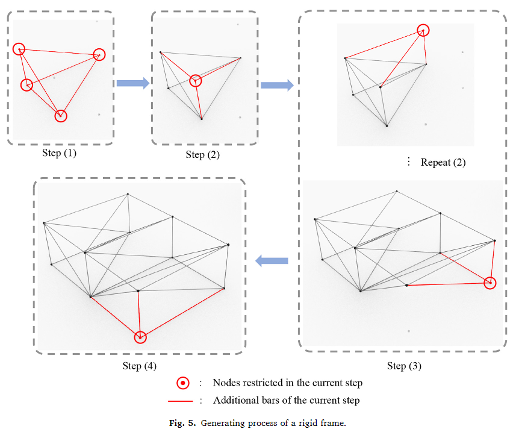

# NERS 570 F23 Group Project

List any ideas you have for the group project and a brief outline of how it makes use of the topics taught in the course.

## ori-kinematics
a library for simulating the kinematics of origami systems

relation to course topics
- uses github and programming workflows
- uses object-oriented programming paradigm
- uses performant software packages to get the best performance

Generate a mesh using the algorithm provided in Zhang and Kawaguchi 2021

more resources on kinematic simulation: [link](https://siggraphcontact.github.io/) 